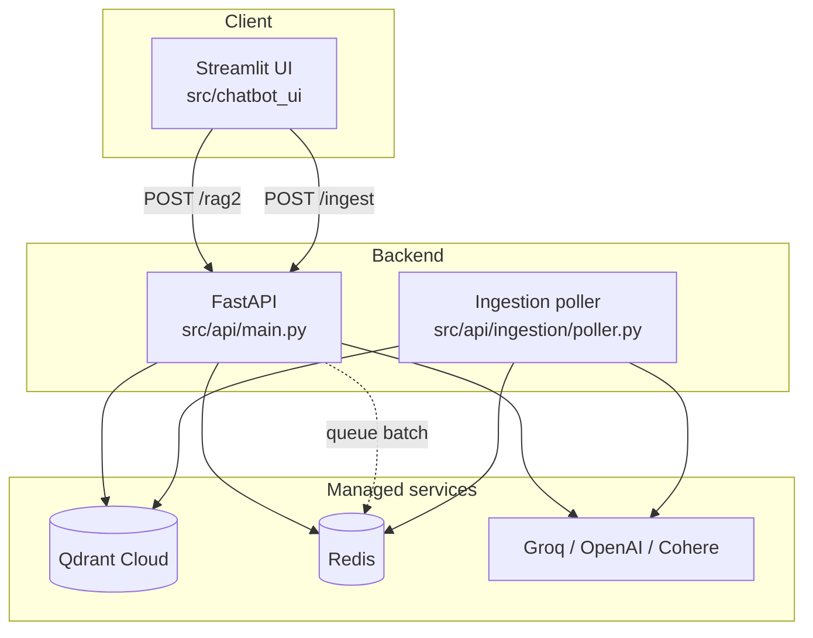

# Architecture Overview

The system is four cooperating processes plus three managed services.



## Components

### Frontend — `src/chatbot_ui`

A Streamlit application ([`main.py`](../reference/frontend.md)) that renders the chat,
uploads PDFs, and calls the backend over HTTP. It reaches the API through `API_URL`, which
Compose sets to `http://api:8000`.

### Backend — `src/api`

A FastAPI application assembled in [`src/api/main.py`](../reference/api.md). It mounts
`/api/images` as static files so figures extracted during ingestion can be served back to
the UI, adds a request-ID middleware and permissive CORS, and includes three routers:

| Router | Module | Tag |
| --- | --- | --- |
| System | `src.api.api.system_router` | `system` |
| RAG | `src.api.api.rag_router` | `rag` |
| Ingestion | `src.api.api.ingestion_router` | `ingestion` |

See [API Surface](api.md) for the endpoints.

### Ingestion worker — `src/api/ingestion/poller.py`

A separate container running `python -m src.api.ingestion.poller`. It watches for completed
OpenAI batch jobs, downloads the results, embeds them, and upserts them into Qdrant. See
[Ingestion](ingestion.md).

### Redis

Two roles: per-session conversation memory (pickled `ConversationMemory` objects with a
one-hour TTL) and the coordination store for batch ingestion metadata.

### Qdrant

Holds chunk embeddings and payload metadata — `text`, `file_title`, `authors`, `year`,
`page_number`, `type` (`text` or `figure`), `image_path`, and `caption`.

## Observability

Every meaningful step is decorated with LangSmith's `@traceable`, tagged by run type
(`retriever`, `reranker`, `embedding`, `prompt`, `llm`). Tracing is toggled through
`LANGSMITH_TRACING`; the environment variables are exported at the top of `main.py` before
anything else imports LangChain.

## Repository layout

```
.
├── src/
│   ├── api/               # FastAPI backend
│   │   ├── api/           # routers, models, middleware
│   │   ├── core/          # config, database, storage
│   │   ├── ingestion/     # sync + batch ingestion, worker, poller
│   │   ├── rag/           # retrieval, reranking, prompting, generation
│   │   └── redis/         # chat-history inspection utilities
│   └── chatbot_ui/        # Streamlit frontend
├── ingestion_batch/       # standalone batch ingestion script (make ingest)
├── evals/                 # dataset creation + retriever evaluation
├── docling_trial/         # Docling parsing experiments and benchmarks
├── notebooks/             # exploratory notebooks
├── docs/                  # this documentation
├── docker-compose.yml     # local dev stack
├── docker-compose.prod.yml# Azure deployment
└── Makefile
```
