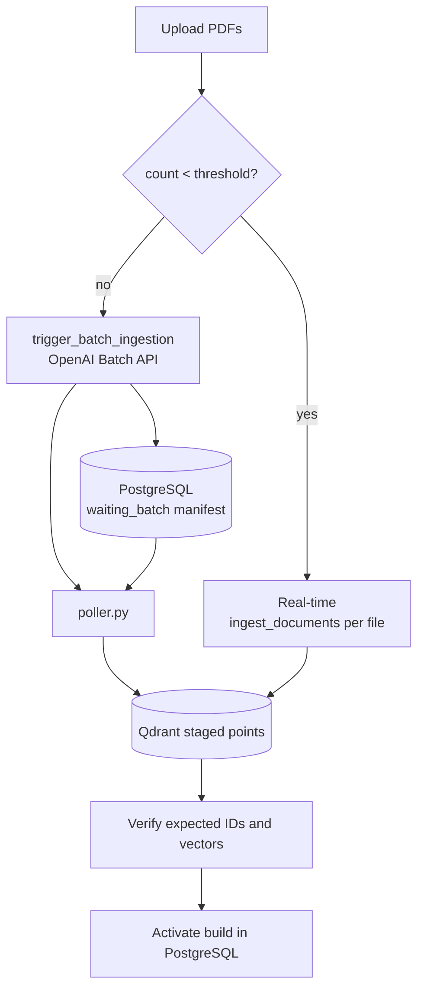

# Ingestion

Ingestion turns PDFs into embedded, metadata-rich chunks in Qdrant. There are two entry
points: the API-driven path used by the UI, and a standalone batch script.

## Smart batching

`start_smart_ingestion` in [`src/api/ingestion/worker.py`](../reference/ingestion.md) picks a
strategy based on volume, comparing the file count against
`config.INGESTION_BATCH_THRESHOLD`:



- **Real-time path** — each file goes straight through `ingest_documents`, blocking until
  done. Suitable for a handful of uploads.
- **Batch path** — figure analysis is offloaded to the OpenAI Batch API, which has a 24-hour
  completion window. The mapping from batch request to source document is stored durably
  in PostgreSQL. Text is staged but not queryable until all figures complete and verify.

## The poller

`src/api/ingestion/poller.py` runs as its own container and loops over:

| Step | Action |
| --- | --- |
| Check | Query OpenAI for the batch ID to see whether the window has closed |
| Download | Fetch the `.jsonl` result file with the generated figure descriptions |
| Map | Match `custom_id` against the SQL build manifest to recover the source PDF |
| Embed | Call the embedding API so descriptions are searchable semantically |
| Upsert | Write the points into Qdrant |
| Verify/activate | Check the full expected point set before making the build queryable |

It has its own healthcheck (`python -m src.api.healthcheck`) so Compose can restart it if it
wedges.

## Document processing

`src/api/papers/uploads.py` coordinates registration, artifacts, indexing and activation.
It reuses processing helpers from `src/api/ingestion/ingest_documents.py`:

- `get_file_hash` — content hash, used to build stable point IDs and avoid duplicates.
- `extract_raw_content` — shared PyMuPDF4LLM text extraction plus existing figure workers.
- `src/api/papers/extraction.py` — page-aware Markdown, heading/paragraph-aware token
  chunking, complete table rows with repeated headers, and page/section provenance.
  Tables whose layout cannot retain complete rows are stored as explicitly labelled
  `table_unstructured` evidence rather than dropped. Both arXiv and GUI uploads use it.
  `get_text_chunks_recursive` remains a legacy helper.
- `identify_figures_on_page` / `process_single_page` — locate figures and process pages.
- `describe_image_with_gpt4o` — generate a searchable description for an extracted figure
  from its base64 image and caption.
- `extract_metadata_fast` — structured extraction into `AdditionalMetadata` (authors, title,
  year, keywords) using the Groq `metadata_model`.
- `robust_summarize_text` / `rate_limited_summarize` — chunk summaries with rate limiting.
- `OpenAIEmbeddings` — a LangChain `Embeddings` implementation over the OpenAI API.

Figures become their own Qdrant points with `type: "figure"`, an `image_path`, and a
`caption`, which is what lets the RAG pipeline return images alongside text.

## Standalone batch ingestion

```bash
make ingest     # uv run python -m ingestion_batch.ingest_to_qdrant_oai
```

This legacy script bypasses the shared catalogue and is not the supported ingestion
workflow. Use the upload API or arXiv CLI; existing uncatalogued vectors require explicit
adoption. See [Catalogue upgrade and audit](../operations/catalogue.md).

## Docling

`docling_trial/` contains an experiment using [Docling](https://github.com/docling-project/docling)
as an alternative PDF parser with much richer layout understanding. It is a declared
dependency but not yet wired into the main pipeline — see
[Benchmarks](../operations/benchmarks.md) for the timings that decision hinges on.
