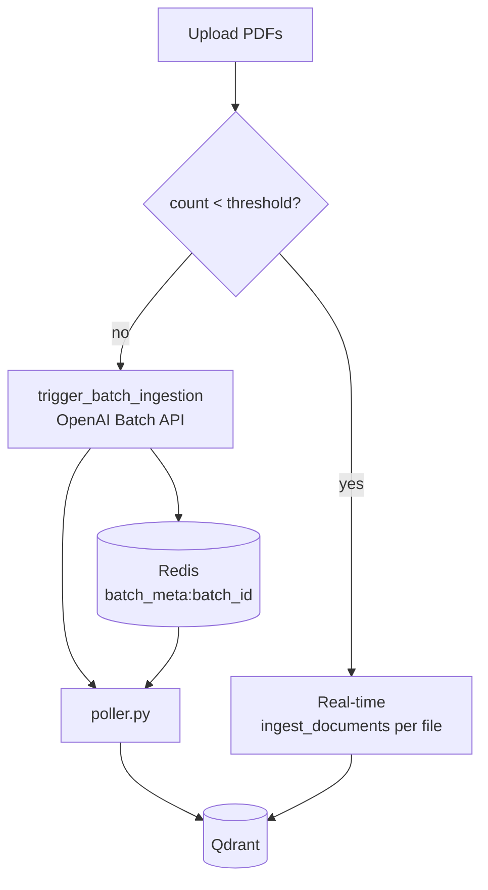

# Ingestion

Ingestion turns PDFs into embedded, metadata-rich chunks in Qdrant. There are two entry
points: the API-driven path used by the UI, and a standalone batch script.

## Smart batching

`start_smart_ingestion` in [`src/api/ingestion/worker.py`](../reference/ingestion.md) picks a
strategy based on volume, comparing the file count against
`config.INGESTION_BATCH_THRESHOLD`:



- **Real-time path** — each file goes straight through `ingest_documents`, blocking until
  done. Suitable for a handful of uploads.
- **Batch path** — figure analysis is offloaded to the OpenAI Batch API, which has a 24-hour
  completion window but costs substantially less. The mapping from batch request to source
  document is stored in Redis under `batch_meta:{batch_id}`.

## The poller

`src/api/ingestion/poller.py` runs as its own container and loops over:

| Step | Action |
| --- | --- |
| Check | Query OpenAI for the batch ID to see whether the window has closed |
| Download | Fetch the `.jsonl` result file with the generated figure descriptions |
| Map | Match `custom_id` against the Redis metadata to recover the source PDF |
| Embed | Call the embedding API so descriptions are searchable semantically |
| Upsert | Write the points into Qdrant |

It has its own healthcheck (`python -m src.api.healthcheck`) so Compose can restart it if it
wedges.

## Document processing

`src/api/ingestion/ingest_documents.py` does the actual work per file:

- `get_file_hash` — content hash, used to build stable point IDs and avoid duplicates.
- `extract_raw_content` — text and page structure extraction (PyMuPDF).
- `get_text_chunks_recursive` — recursive character chunking.
- `identify_figures_on_page` / `process_single_page` — locate figures and process pages.
- `describe_image_with_gpt4o` — generate a searchable description for an extracted figure
  from its base64 image and caption.
- `extract_metadata_fast` — structured extraction into `AdditionalMetadata` (authors, title,
  year, keywords) using the Groq `metadata_model`.
- `robust_summarize_text` / `rate_limited_summarize` — chunk summaries with rate limiting.
- `OpenAIEmbeddings` — a LangChain `Embeddings` implementation over the OpenAI API.

Figures become their own Qdrant points with `type: "figure"`, an `image_path`, and a
`caption`, which is what lets the RAG pipeline return images alongside text.

## Standalone batch ingestion

```bash
make ingest     # uv run python -m ingestion_batch.ingest_to_qdrant_oai
```

This bypasses the API entirely and is the fastest way to seed a fresh collection from a local
directory of PDFs.

## Docling

`docling_trial/` contains an experiment using [Docling](https://github.com/docling-project/docling)
as an alternative PDF parser with much richer layout understanding. It is a declared
dependency but not yet wired into the main pipeline — see
[Benchmarks](../operations/benchmarks.md) for the timings that decision hinges on.
