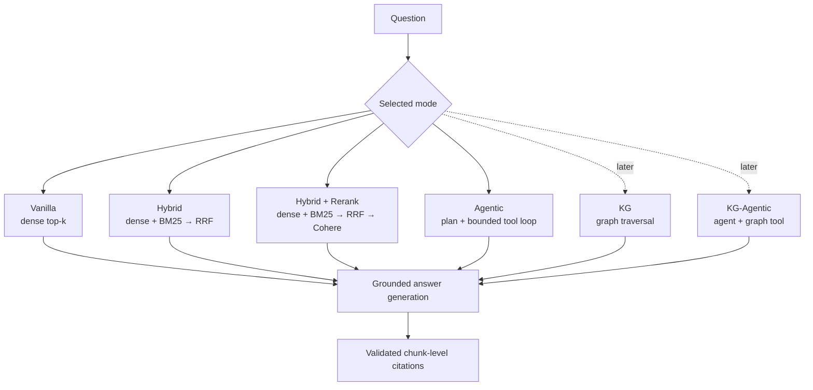

# RAG modes

This project treats each RAG architecture as an explicit comparison mode over the same
scientific-paper corpus. A mode describes **how evidence is selected before answer
generation**. Vanilla, Hybrid, Hybrid + Rerank and Agentic are available in the API and Streamlit;
knowledge-graph modes remain planned and are deliberately labelled as such.

## At a glance

| Mode | Status | Evidence acquisition | Adaptive rounds | Graph evidence |
| --- | --- | --- | ---: | ---: |
| **Vanilla** | Available | One dense-vector search in Qdrant | 1 | No |
| **Hybrid** | Available | Dense + BM25 sparse retrieval, fused with RRF | 1 | No |
| **Hybrid + Rerank** (`hybrid_rerank`) | Available | Hybrid candidates, then Cohere reranking | 1 | No |
| **Agentic** | Available | A bounded LangGraph agent selects dense, sparse, hybrid and expansion tools | Up to 3 | No |
| **KG** | Placeholder | Deterministic graph search/traversal | 1 | Yes |
| **KG-Agentic** | Placeholder | The bounded agent combines vector, metadata and graph tools | Up to 3 | Yes |

All modes will share the same corpus scope, evidence provenance, grounding prompt and
citation validation. This is essential for meaningful evaluation: changing the retrieval
architecture should not silently change the corpus or answer contract.

## Vanilla RAG

Vanilla is the experimental baseline. It:

1. embeds the user's question with the configured OpenAI embedding model;
2. performs one dense-vector search in the selected Qdrant collection;
3. keeps the top `top_k` chunks (five by default);
4. sends those chunks to the shared answer generator;
5. returns only sources whose retrieved chunk IDs the generator cited.

Vanilla does not use full-text matching, Cohere reranking, query decomposition, metadata
discovery, retries with reformulated searches, section expansion or graph traversal. It is
implemented in `src/api/rag/modes/vanilla.py` and remains unchanged as a control.

## Hybrid RAG

Hybrid is the lexical-plus-semantic one-shot retrieval baseline. It:

1. embeds the question once;
2. asks Qdrant for dense candidates and independently for BM25 sparse candidates;
3. combines both rankings with reciprocal-rank fusion (RRF);
4. keeps the top `top_k` fused chunks and uses the same generator/citation path as Vanilla.

The sparse branch uses deterministic word-token hashes and BM25 term-frequency/length
weights. Qdrant applies collection-dependent IDF at query time. It requires no sparse
embedding API or downloaded model. The fixed average chunk length is versioned in the
index specification; changing it requires a new collection and re-index.

Hybrid is implemented in `src/api/rag/modes/hybrid.py`. It is still one retrieval round and
cannot decide to search another paper or expand weak evidence.

## Hybrid + Rerank RAG

`hybrid_rerank` runs the same dense + BM25 + RRF search with a larger candidate pool, sends
those candidates to Cohere `rerank-english-v3.0`, and keeps the top `top_k`. This isolates
the effect and cost of reranking from the effect of adding lexical retrieval. It requires a
working Cohere credential; plain `hybrid` does not. Its mode module is
`src/api/rag/modes/hybrid_rerank.py`.

Earlier recorded results called the old full-text-constrained, Cohere-reranked pipeline
“Hybrid.” Treat those as historical baselines, not results for the new sparse implementation.
See [Evaluation results](../operations/evaluation-results.md).

## Agentic RAG

Agentic RAG is available through `POST /rag2` with `mode: "agentic"` and through the
Streamlit retrieval-mode selector. Its runtime wraps the existing read-only retrieval
capabilities in a constrained LangGraph tool loop plus the shared synthesizer:

1. classify the evidence need as direct, within-paper, cross-paper or metadata discovery;
2. decompose complex questions into explicit subquestions;
3. use PostgreSQL paper discovery and scoped Qdrant dense, sparse or hybrid chunk search;
4. expand an exact section or neighbouring chunks when initial evidence is incomplete;
5. assess evidence sufficiency and either stop, reformulate or perform another retrieval;
6. stop after at most three retrieval rounds, on repeated evidence, or when its budget ends;
7. answer only from accumulated evidence, otherwise abstain explicitly.

The agent receives no ingestion, deletion or database-mutation tools. LangChain exposes only
paper search, chunk search, exact-section retrieval, neighbouring-chunk retrieval and two
terminal decisions. LangGraph manages the bounded state loop; application policy enforces
the corpus scope and budgets. Tool calls, evidence IDs, budgets and stop reason are traced in
Langfuse. The implementation sequence and acceptance criteria are in the
[RAG evolution roadmap](rag-evolution-roadmap.md).

### Intent routing is not Agentic RAG

The existing legacy intent router makes one classification and dispatches to a predefined
metadata handler or the ordinary RAG pipeline. It does not decompose a question, select a
sequence of tools, inspect evidence sufficiency, reformulate failed searches or perform a
bounded retrieval loop. Therefore, the presence of intent routing does **not** make the
legacy intent-routed path Agentic RAG. All four explicit comparison modes bypass
that router.

## Knowledge-graph RAG

KG-RAG is a future placeholder, not an implemented feature. The intended graph will model
scientific entities and claims—such as papers, authors, astronomical objects, instruments,
methods and measurements—with every node/edge linked back to its source build, chunk and
page. No graph database or final graph schema has been selected yet.

Two modes are intentionally planned:

- **KG:** deterministic graph retrieval followed by the shared answer generator;
- **KG-Agentic:** the bounded agent may use graph traversal alongside metadata and vector
  tools.

Keeping these separate lets evaluation distinguish gains from graph structure from gains
caused by iterative planning. PostgreSQL catalogue metadata is not itself the scientific
knowledge graph.

## Availability and selection

Currently:

- Streamlit and `POST /rag2` expose `vanilla`, `hybrid`, `hybrid_rerank` and `agentic`.
- The evaluation runner accepts all four implemented modes.
- `kg` and `kg_agentic` are reserved names in the roadmap, not accepted runtime modes.
- Omitting an explicit mode preserves the legacy intent-routed API behaviour; it should not
  be reported as another comparison architecture.

All four implemented modes will remain available after KG modes are added so they can be
compared against the same frozen evaluation corpus.
