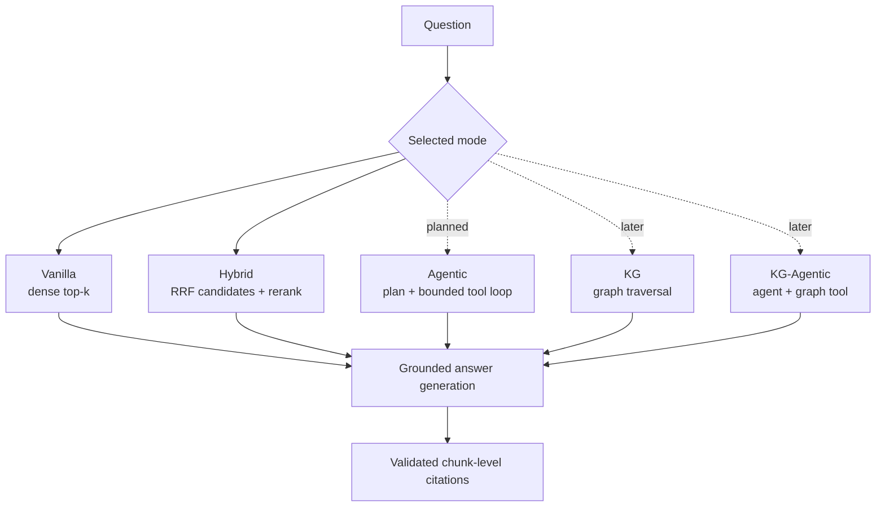

# RAG modes

This project treats each RAG architecture as an explicit comparison mode over the same
scientific-paper corpus. A mode describes **how evidence is selected before answer
generation**. Vanilla and Hybrid are available today. Agentic and knowledge-graph modes are
planned and are deliberately labelled as such wherever they are mentioned.

## At a glance

| Mode | Status | Evidence acquisition | Adaptive rounds | Graph evidence |
| --- | --- | --- | ---: | ---: |
| **Vanilla** | Available | One dense-vector search in Qdrant | 1 | No |
| **Hybrid** | Available | Dense/full-text-constrained fusion, then Cohere reranking | 1 | No |
| **Agentic** | Planned | A bounded planner selects and combines read-only retrieval tools | Up to 3 | No |
| **KG** | Placeholder | Deterministic graph search/traversal | 1 | Yes |
| **KG-Agentic** | Placeholder | The bounded agent combines vector, metadata and graph tools | Up to 3 | Yes |

All modes will share the same corpus scope, evidence provenance, grounding prompt and
citation validation. This is essential for meaningful evaluation: changing the retrieval
architecture should not silently change the corpus or answer contract.

## Vanilla RAG

Vanilla is the experimental baseline. It:

1. embeds the user's question with the configured OpenAI embedding model;
2. performs one dense-vector search in the selected Qdrant collection;
3. keeps the top `top_k` chunks (five by default);
4. sends those chunks to the shared answer generator;
5. returns only sources whose retrieved chunk IDs the generator cited.

Vanilla does not use full-text matching, Cohere reranking, query decomposition, metadata
discovery, retries with reformulated searches, section expansion or graph traversal. It is
implemented in `src/api/rag/modes/vanilla.py` and remains unchanged as a control.

## Hybrid RAG

Hybrid is the stronger one-shot retrieval baseline. It:

1. embeds the question once;
2. asks Qdrant for a dense candidate set and a second dense candidate set constrained by
   full-text `MatchText` on the payload;
3. combines both rankings with reciprocal-rank fusion (RRF);
4. retrieves 20 candidates and reranks them with Cohere `rerank-english-v3.0`;
5. keeps the top `top_k` chunks and uses the same generator/citation path as Vanilla.

!!! important "What Hybrid does not mean here"
    This implementation is not BM25 plus vector search and does not use a learned sparse
    vector. Its lexical branch is a full-text-constrained dense query. It is still one
    retrieval round and cannot decide to search another paper or expand weak evidence.

Hybrid is implemented in `src/api/rag/modes/hybrid.py`. The current reviewed benchmark found
it stronger than Vanilla overall, although difficult cross-paper profiles still leave room
for improvement. See [Evaluation results](../operations/evaluation-results.md).

## Agentic RAG

Agentic RAG is the next planned mode; it is **not available in the API or Streamlit yet**.
It will wrap the existing read-only retrieval capabilities in a constrained
planner/executor/synthesizer loop:

1. classify the evidence need as direct, within-paper, cross-paper or metadata discovery;
2. decompose complex questions into explicit subquestions;
3. use PostgreSQL paper discovery and scoped Qdrant chunk search;
4. expand an exact section or neighbouring chunks when initial evidence is incomplete;
5. assess evidence sufficiency and either stop, reformulate or perform another retrieval;
6. stop after at most three retrieval rounds, on repeated evidence, or when its budget ends;
7. answer only from accumulated evidence, otherwise abstain explicitly.

The agent will receive no ingestion, deletion or database-mutation tools. Its structured
plan, tool calls, evidence IDs, budgets and stop reason will be traced in Langfuse. The
implementation sequence and acceptance criteria are in the
[RAG evolution roadmap](rag-evolution-roadmap.md).

### Intent routing is not Agentic RAG

The existing legacy intent router makes one classification and dispatches to a predefined
metadata handler or the ordinary RAG pipeline. It does not decompose a question, select a
sequence of tools, inspect evidence sufficiency, reformulate failed searches or perform a
bounded retrieval loop. Therefore, the presence of intent routing does **not** make the
current application Agentic RAG. Explicit Vanilla/Hybrid requests bypass that router.

## Knowledge-graph RAG

KG-RAG is a future placeholder, not an implemented feature. The intended graph will model
scientific entities and claims—such as papers, authors, astronomical objects, instruments,
methods and measurements—with every node/edge linked back to its source build, chunk and
page. No graph database or final graph schema has been selected yet.

Two modes are intentionally planned:

- **KG:** deterministic graph retrieval followed by the shared answer generator;
- **KG-Agentic:** the bounded agent may use graph traversal alongside metadata and vector
  tools.

Keeping these separate lets evaluation distinguish gains from graph structure from gains
caused by iterative planning. PostgreSQL catalogue metadata is not itself the scientific
knowledge graph.

## Availability and selection

Currently:

- Streamlit and `POST /rag2` expose `vanilla` and `hybrid` comparison modes.
- The evaluation runner accepts only `vanilla` and `hybrid`.
- `agentic`, `kg` and `kg_agentic` are reserved names in the roadmap, not accepted runtime
  modes.
- Omitting an explicit mode preserves the legacy intent-routed API behaviour; it should not
  be reported as another comparison architecture.

Vanilla and Hybrid will remain available after Agentic and KG modes are added so all modes
can be compared against the same frozen evaluation corpus.
