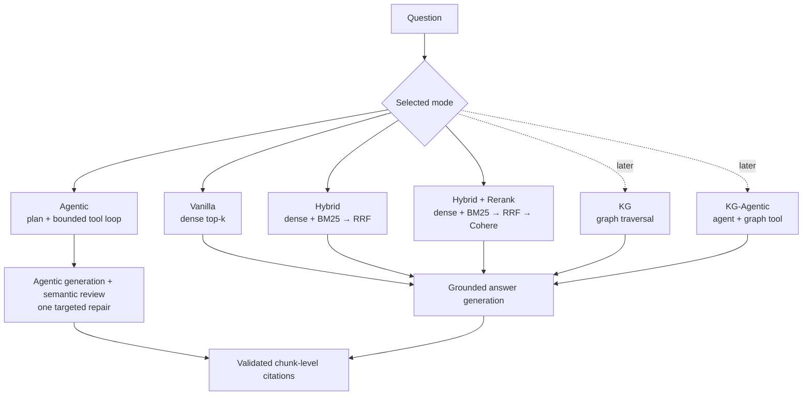

# RAG modes

This project treats each RAG architecture as an explicit comparison mode over the same
scientific-paper corpus. A mode describes **how evidence is selected before answer
generation**. Vanilla, Hybrid, Hybrid + Rerank and Agentic are available in the API and Streamlit;
knowledge-graph modes remain planned and are deliberately labelled as such.

## At a glance

| Mode | Status | Evidence acquisition | Adaptive rounds | Graph evidence |
| --- | --- | --- | ---: | ---: |
| **Vanilla** | Available | One dense-vector search in Qdrant | 1 | No |
| **Hybrid** | Available | Dense + BM25 sparse retrieval, fused with RRF | 1 | No |
| **Hybrid + Rerank** (`hybrid_rerank`) | Available | Hybrid candidates, then Cohere reranking | 1 | No |
| **Agentic** | Available | A bounded LangGraph agent selects dense, sparse, hybrid and expansion tools | Up to 3 | No |
| **KG** | Placeholder | Deterministic graph search/traversal | 1 | Yes |
| **KG-Agentic** | Placeholder | The bounded agent combines vector, metadata and graph tools | Up to 3 | Yes |

All modes share the corpus scope, evidence provenance and atomic-claim output schema.
Vanilla, Hybrid and Hybrid + Rerank retain their baseline generation path. Agentic additionally
reviews claim support and answer completeness, with one targeted repair. This is an explicit
generation-policy difference: compare whole pipelines, including the added latency and cost,
rather than attributing every score change solely to retrieval.

```mermaid
flowchart TB
    Q[Question] --> M{Selected mode}
    M --> V[Vanilla<br/>dense top-k]
    M --> H[Hybrid<br/>dense + BM25 → RRF]
    M --> HR[Hybrid + Rerank<br/>dense + BM25 → RRF → Cohere]
    M --> A[Agentic<br/>plan + bounded tool loop]
    M -. later .-> K[KG<br/>graph traversal]
    M -. later .-> KA[KG-Agentic<br/>agent + graph tool]
    V --> G[Grounded answer generation]
    H --> G
    HR --> G
    A --> AG[Agentic generation + semantic review<br/>one targeted repair]
    AG --> C
    K --> G
    KA --> G
    G --> C[Validated chunk-level citations]
```

## Vanilla RAG

Vanilla is the experimental baseline. It:

1. embeds the user's question with the configured OpenAI embedding model;
2. performs one dense-vector search in the selected Qdrant collection;
3. keeps the top `top_k` chunks (five by default);
4. sends those chunks to the shared answer generator;
5. returns only sources whose retrieved chunk IDs the generator cited.

Vanilla does not use full-text matching, Cohere reranking, query decomposition, metadata
discovery, retries with reformulated searches, section expansion or graph traversal. It is
implemented in `src/api/rag/modes/vanilla.py` and remains unchanged as a control.

## Hybrid RAG

Hybrid is the lexical-plus-semantic one-shot retrieval baseline. It:

1. embeds the question once;
2. asks Qdrant for dense candidates and independently for BM25 sparse candidates;
3. combines both rankings with reciprocal-rank fusion (RRF);
4. keeps the top `top_k` fused chunks and uses the same generator/citation path as Vanilla.

The sparse branch uses deterministic word-token hashes and BM25 term-frequency/length
weights. Qdrant applies collection-dependent IDF at query time. It requires no sparse
embedding API or downloaded model. The fixed average chunk length is versioned in the
index specification; changing it requires a new collection and re-index.

Hybrid is implemented in `src/api/rag/modes/hybrid.py`. It is still one retrieval round and
cannot decide to search another paper or expand weak evidence.

## Hybrid + Rerank RAG

`hybrid_rerank` runs the same dense + BM25 + RRF search with a larger candidate pool, sends
those candidates to Cohere `rerank-english-v3.0`, and keeps the top `top_k`. This isolates
the effect and cost of reranking from the effect of adding lexical retrieval. It requires a
working Cohere credential; plain `hybrid` does not. Its mode module is
`src/api/rag/modes/hybrid_rerank.py`.

For comparisons that quote full indexed paper titles, final selection reserves the
highest-ranked candidate from every named paper present in the candidate pool, then fills
the remaining slots in Cohere order. This prevents global top-k truncation from silently
dropping an explicitly requested paper while leaving ordinary queries unchanged.

The baseline answer generator also requires at least one cited retrieved chunk from every
explicitly named paper available in the final context. A citation-incomplete response gets
one bounded corrective retry; a second failure is rejected rather than returned with
incomplete cross-paper attribution.

Generation returns atomic claim records, each with its text, exact cited chunk IDs and (for
Agentic only) the evidence need IDs it answers. The API includes these records, and the displayed
answer places numbered citations beside each claim; source entries identify the cited evidence
IDs and page. Citation identity checks reject missing, unavailable or duplicate IDs.
Agentic separately checks factual support against each claim's own cited text; search origin
is not a citation constraint. If no claim can be verified, Agentic abstains explicitly.

Every explicit mode resolves quoted full titles against PostgreSQL and compares required
build IDs with retrieved chunks. Baseline modes abstain before generation when a resolved
paper is absent. Agentic may instead return a verified partial answer, explicitly identifying
missing requested details; it must not supply a missing paper's findings from prior knowledge.

Earlier recorded results called the old full-text-constrained, Cohere-reranked pipeline
“Hybrid.” Treat those as historical baselines, not results for the new sparse implementation.
See [Evaluation results](../operations/evaluation-results.md).

## Agentic RAG

Agentic RAG is available through `POST /rag2` with `mode: "agentic"` and through the
Streamlit retrieval-mode selector. Its runtime wraps the existing read-only retrieval
capabilities in a constrained LangGraph tool loop plus Agentic-specific reviewed synthesis:

1. call `define_requirements` once before retrieval, listing the facts the question requests;
2. freeze these descriptions with graph-assigned IDs `r1`, `r2`, etc.; retrieval calls reuse
   these IDs and cannot add requirements through searches or reformulations;
3. use PostgreSQL paper discovery and scoped Qdrant dense, sparse or hybrid chunk search;
4. expand an exact section or neighbouring chunks when initial evidence is incomplete;
5. assess evidence sufficiency and either stop, reformulate or perform another retrieval;
6. stop after at most three retrieval rounds, on repeated evidence, or when its budget ends;
7. generate claims, check their cited evidence and semantic answer coverage, then make at
   most one targeted repair; return verified claims with explicit gaps, or abstain if none remain.

The agent receives no ingestion, deletion or database-mutation tools. LangChain exposes only
requirement definition, paper search, chunk search, exact-section retrieval, neighbouring-chunk retrieval and two
terminal decisions. LangGraph manages the bounded state loop; application policy enforces
the corpus scope and budgets. Tool calls, evidence IDs, budgets and stop reason are traced in
Langfuse. The implementation sequence and acceptance criteria are in the
[RAG evolution roadmap](rag-evolution-roadmap.md).

Paper-level coverage is necessary but not sufficient: when one named paper is queried for
several measurements, the agent must search those measurements separately and assess each
need against the returned text. Per-action `need_id` and bounded query text are persisted in
evaluation `results.json` and Langfuse, but are not presented as hidden model reasoning.
Search coverage is diagnostic, not proof that a fact is answered. Any scoped retrieved chunk
can support any requirement, regardless of which search found it.

### Previews and targeted reading

Chunk searches return 700-character previews with `text_truncated` and original `text_chars`.
A truncated preview is not evidence that the requested detail is absent. The planner can use
`get_neighbors(before=0, after=0)` to read just that chunk, or `get_section` to read its section.

Both expansion tools expose full text up to **12,000 text characters per response**, marking
any remaining truncation explicitly. Neighbour reads allocate that budget to the anchor first,
but keep returned chunks in document order. The budget excludes metadata and is not a token
limit; existing cumulative planner-token limits still apply. Full evidence artifacts used for
generation are unchanged. The neighbour tool schema exposes and validates **0–5 per side**
and non-negative chunk ordinals; it does not silently clamp invalid requests.

Once the requested facts are visible, the planner is instructed to finish instead of
repeatedly expanding the same answer. This is model guidance, not a guaranteed round count.

### Agentic answer checks and repair

`modes/agentic/answering.py` separates three checks:

- **Citation integrity:** every claim cites distinct IDs from this request's retrieved context.
  An invalid claim is removed without discarding other valid claims.
- **Claim support:** a model reviews each claim against only its own cited excerpts and source
  metadata. It checks attribution, values, units, range endpoints and qualifications.
- **Answer completeness:** the review checks the actual answer against the frozen requirements
  and original question. A `need_id` label or a value present only in evidence is not an answer.

If necessary, one repair requests only corrected/additional claims and preserves previously
verified ones. Remaining gaps appear in the displayed answer. No verified claims means a safe
abstention; partial evidence no longer forces the entire answer to disappear.

The API, benchmark results and Langfuse record `generation_diagnostics`: `complete`,
`partial` or `safe_abstention`, per-requirement coverage and validation attempts.
Semantic support is a model assessment, not a deterministic proof; human review and independent
evaluation remain necessary.

This adds one planning call for requirement definition. Synthesis uses two calls normally
(draft + review), at most four with repair (draft + review + repair + review), with provider
retries disabled. Each call uses a 60-second timeout and `GENERATION_MODEL_MAX_TOKENS`.
These calls are separate from the Agentic retrieval budgets; planner-token/elapsed diagnostics
describe retrieval, while benchmark latency includes synthesis. There is no fallback to another
RAG mode, no re-indexing requirement and no need to regenerate evaluation questions.

### Intent routing is not Agentic RAG

The existing legacy intent router makes one classification and dispatches to a predefined
metadata handler or the ordinary RAG pipeline. It does not decompose a question, select a
sequence of tools, inspect evidence sufficiency, reformulate failed searches or perform a
bounded retrieval loop. Therefore, the presence of intent routing does **not** make the
legacy intent-routed path Agentic RAG. All four explicit comparison modes bypass
that router.

## Knowledge-graph RAG

KG-RAG is a future placeholder, not an implemented feature. The intended graph will model
scientific entities and claims—such as papers, authors, astronomical objects, instruments,
methods and measurements—with every node/edge linked back to its source build, chunk and
page. No graph database or final graph schema has been selected yet.

Two modes are intentionally planned:

- **KG:** deterministic graph retrieval followed by the shared answer generator;
- **KG-Agentic:** the bounded agent may use graph traversal alongside metadata and vector
  tools.

Keeping these separate lets evaluation distinguish gains from graph structure from gains
caused by iterative planning. PostgreSQL catalogue metadata is not itself the scientific
knowledge graph.

## Availability and selection

Currently:

- Streamlit and `POST /rag2` expose `vanilla`, `hybrid`, `hybrid_rerank` and `agentic`.
- The evaluation runner accepts all four implemented modes.
- `kg` and `kg_agentic` are reserved names in the roadmap, not accepted runtime modes.
- Omitting an explicit mode preserves the legacy intent-routed API behaviour; it should not
  be reported as another comparison architecture.

All four implemented modes will remain available after KG modes are added so they can be
compared against the same frozen evaluation corpus.
