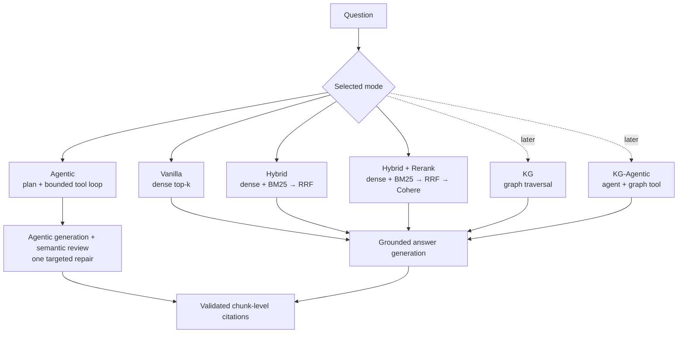

# RAG modes

This project treats each RAG architecture as an explicit comparison mode over the same
scientific-paper corpus. A mode describes **how evidence is selected before answer
generation**. Vanilla, Hybrid, Hybrid + Rerank and Agentic are available in the API and Streamlit;
knowledge-graph modes remain planned and are deliberately labelled as such.

## At a glance

| Mode | Status | Evidence acquisition | Adaptive rounds | Graph evidence |
| --- | --- | --- | ---: | ---: |
| **Vanilla** | Available | One dense-vector search in Qdrant | 1 | No |
| **Hybrid** | Available | Dense + BM25 sparse retrieval, fused with RRF | 1 | No |
| **Hybrid + Rerank** (`hybrid_rerank`) | Available | Hybrid candidates, then Cohere reranking | 1 | No |
| **Agentic** | Available | A bounded LangGraph agent selects dense, sparse, hybrid and expansion tools | Up to 3 | No |
| **KG** | Placeholder | Deterministic graph search/traversal | 1 | Yes |
| **KG-Agentic** | Placeholder | The bounded agent combines vector, metadata and graph tools | Up to 3 | Yes |

All modes share the corpus scope, evidence provenance and atomic-claim output schema.
Vanilla, Hybrid and Hybrid + Rerank retain their baseline generation path. Agentic additionally
reviews claim support and answer completeness, with one targeted repair. This is an explicit
generation-policy difference: compare whole pipelines, including the added latency and cost,
rather than attributing every score change solely to retrieval.

```mermaid
flowchart TB
    Q[Question] --> M{Selected mode}
    M --> V[Vanilla<br/>dense top-k]
    M --> H[Hybrid<br/>dense + BM25 → RRF]
    M --> HR[Hybrid + Rerank<br/>dense + BM25 → RRF → Cohere]
    M --> A[Agentic<br/>plan + bounded tool loop]
    M -. later .-> K[KG<br/>graph traversal]
    M -. later .-> KA[KG-Agentic<br/>agent + graph tool]
    V --> G[Grounded answer generation]
    H --> G
    HR --> G
    A --> AG[Agentic generation + semantic review<br/>one targeted repair]
    AG --> C
    K --> G
    KA --> G
    G --> C[Validated chunk-level citations]
```

## Vanilla RAG

Vanilla is the experimental baseline. It:

1. embeds the user's question with the configured OpenAI embedding model;
2. performs one dense-vector search in the selected Qdrant collection;
3. keeps the top `top_k` chunks (five by default);
4. sends those chunks to the shared answer generator;
5. returns only sources whose retrieved chunk IDs the generator cited.

Vanilla does not use full-text matching, Cohere reranking, query decomposition, metadata
discovery, retries with reformulated searches, section expansion or graph traversal. It is
implemented in `src/api/rag/modes/vanilla.py` and remains unchanged as a control.

## Hybrid RAG

Hybrid is the lexical-plus-semantic one-shot retrieval baseline. It:

1. embeds the question once;
2. asks Qdrant for dense candidates and independently for BM25 sparse candidates;
3. combines both rankings with reciprocal-rank fusion (RRF);
4. keeps the top `top_k` fused chunks and uses the same generator/citation path as Vanilla.

The sparse branch uses deterministic word-token hashes and BM25 term-frequency/length
weights. Qdrant applies collection-dependent IDF at query time. It requires no sparse
embedding API or downloaded model. The fixed average chunk length is versioned in the
index specification; changing it requires a new collection and re-index.

Hybrid is implemented in `src/api/rag/modes/hybrid.py`. It is still one retrieval round and
cannot decide to search another paper or expand weak evidence.

## Hybrid + Rerank RAG

`hybrid_rerank` runs the same dense + BM25 + RRF search with a larger candidate pool, sends
those candidates to Cohere `rerank-english-v3.0`, and keeps the top `top_k`. This isolates
the effect and cost of reranking from the effect of adding lexical retrieval. It requires a
working Cohere credential; plain `hybrid` does not. Its mode module is
`src/api/rag/modes/hybrid_rerank.py`.

For comparisons that quote full indexed paper titles, final selection reserves the
highest-ranked candidate from every named paper present in the candidate pool, then fills
the remaining slots in Cohere order. This prevents global top-k truncation from silently
dropping an explicitly requested paper while leaving ordinary queries unchanged.

The baseline answer generator also requires at least one cited retrieved chunk from every
explicitly named paper available in the final context. A citation-incomplete response gets
one bounded corrective retry; a second failure is rejected rather than returned with
incomplete cross-paper attribution.

Generation returns atomic claim records, each with its text, exact cited chunk IDs and (for
Agentic only) the evidence need IDs it answers. The API includes these records, and the displayed
answer places numbered citations beside each claim; source entries identify the cited evidence
IDs and page. Citation identity checks reject missing, unavailable or duplicate IDs.
Agentic separately checks factual support against each claim's own cited text; search origin
is not a citation constraint. If no claim can be verified, Agentic abstains explicitly.

Every explicit mode resolves quoted full titles against PostgreSQL and compares required
build IDs with retrieved chunks. Baseline modes abstain before generation when a resolved
paper is absent. Agentic may instead return a verified partial answer, explicitly identifying
missing requested details; it must not supply a missing paper's findings from prior knowledge.
Agentic also resolves explicit `arXiv:ID[vN]` references and arXiv abs/pdf URLs, without
requiring quotation marks. Resolution stays inside the active/frozen build scope and checks
an explicitly requested version. Confirmed full titles/IDs become build filters, not search
terms, on both initial and later queries. Baseline modes retain their quoted-title behavior.

Earlier recorded results called the old full-text-constrained, Cohere-reranked pipeline
“Hybrid.” Treat those as historical baselines, not results for the new sparse implementation.
See [Evaluation results](../operations/evaluation-results.md).

## Agentic RAG

Agentic RAG is available through `POST /rag2` with `mode: "agentic"` and through the
Streamlit retrieval-mode selector. Its runtime wraps the existing read-only retrieval
capabilities in a constrained LangGraph tool loop plus Agentic-specific reviewed synthesis:

1. call `define_requirements` once before retrieval, listing answer requirements **and** a
   separate initial search plan;
2. freeze these descriptions with graph-assigned IDs `r1`, `r2`, etc.; retrieval calls reuse
   these IDs and cannot add requirements through searches or reformulations;
   execute the planned queries directly, not the requirement descriptions. One query can
   support several requirements; synthesis-only requirements need no separate search;
3. use PostgreSQL paper discovery and scoped Qdrant dense, sparse or hybrid chunk search;
4. expand an exact section or neighbouring chunks when initial evidence is incomplete;
5. assess evidence sufficiency and either stop, reformulate or perform another retrieval;
6. stop after at most three retrieval rounds, on repeated evidence, or when its budget ends;
7. generate claims, check their cited evidence and semantic answer coverage, then make at
   most one targeted repair; return verified claims with explicit gaps, or abstain if none remain.

The agent receives no ingestion, deletion or database-mutation tools. LangChain exposes only
requirement definition, paper search, chunk search, exact-section retrieval, neighbouring-chunk retrieval and two
terminal decisions. LangGraph manages the bounded state loop; application policy enforces
the corpus scope and budgets. Tool calls, evidence IDs, budgets and stop reason are traced in
Langfuse. The implementation sequence and acceptance criteria are in the
[RAG evolution roadmap](rag-evolution-roadmap.md).

Paper-level coverage is necessary but not sufficient: assess each requested fact against
the returned text. Search independently located measurements separately; facts likely in
one passage may share a query. Per-action `need_id`, `need_ids` and bounded query text are persisted in
evaluation `results.json` and Langfuse, but are not presented as hidden model reasoning.
Search coverage is diagnostic, not proof that a fact is answered. Any scoped retrieved chunk
can support any requirement, regardless of which search found it.

### Search planning and parallel execution

Complexity is about evidence locations and dependencies, not question length. The existing
planner decides this in its first call; there is no extra classification request or fixed
question-specific rule. A single fact can use one Hybrid query. Independent facts in different
papers/sections may need several queries. A comparison combines the retrieved facts and does
not automatically require a third search.

For example, an answer requirement might be “Report the measured cluster mass with its
uncertainty,” while its search query is “dynamical mass uncertainty.” A second requirement
“Compare the two mass estimates” can be marked `kind: synthesis`; the final answer review
still checks it, but retrieval does not invent a mandatory comparison query.

The native `define_requirements` schema accepts `descriptions`, `initial_searches` (query,
1-based `requirement_indices`, mode, filters and limit), `synthesis_indices`, and
`parameter_effects`. Each effect records its literal requested parameter, effect requirement
index and nullable baseline index. A declared baseline needs a different factual index and
distinct focused search. Missing effect declarations, invalid indices and non-question
parameter names use the existing one-definition correction.
For explicit coordinated measurement-plus-effect requests, a null baseline no longer
bypasses this separation. Effect-only requests still permit null; the grammatical routing
hint is not an exhaustive scientific classifier. Validated effects also freeze
`effect_parameters` on their requirements for subsequent answer review.
Use an empty initial list when catalogue discovery must happen first. This replaces the old
automatic one-description/one-search mapping; it does not add another planner call.

If this initial definition fails schema validation, the graph returns a native tool-error
message with safe field paths (for example `initial_searches[0].query`) and error codes,
then permits **one corrective planner call**. Requirements freeze only after validation.
Parameter-effect failures now identify the specific rule and indexed field, with a static
correction message. For example, `parameter_effects[0].baseline_requirement_index` /
`baseline_required` asks for a separate baseline entry instead of null; `parameter_not_in_question`
asks for a literal parameter name, and `baseline_effect_same_query` asks for distinct content
queries **after** confirmed titles/IDs are removed. Case/whitespace changes or different
filters/modes/limits alone do not separate the facts. The same safe `field`, `code` and
`message` are recorded and sent back to the planner; rejected values and raw exception
messages are not copied. These checks live in `agentic/requirement_validation.py`; the
LangGraph/native tool correction flow is unchanged. Effect-only requests and metadata-first
plans remain allowed; no silent rewriting, extra correction or extra normal-path call is added.
The correction is charged to the same cumulative planner-token and retrieval-time limits;
preflight can prevent it. A second malformed definition stops safely. Scope escapes,
mixed tools, duplicate requirements and attempts to redefine frozen requirements still
fail closed without a correction. Valid initial plans incur no extra call.
`execution.requirement_validation_failures` records both rejected schema attempts without
raw arguments, and `requirement_correction_attempts` counts actual corrective model calls.
This uses the existing [native tool-output protocol](https://developers.openai.com/api/docs/guides/function-calling),
not another planning framework or a hidden provider retry.
Standalone tool/field names in requirement descriptions, such as `initial_searches`, now
fail native validation with `internal_tool_requirement` and use this same correction.
Scientific prose mentioning a field is not rejected; invalid entries are not silently removed.

A question requesting **both** a baseline measurement and a parameter effect is now instructed
to use two factual requirements and distinct focused initial queries, even within the same paper.
An effect-only question does not acquire an unrequested baseline requirement. Typed index and
query checks enforce declared separation; identifying every requested parameter remains
model-assessed. The existing question-pattern hint routes these checks, not a new classifier.
Reporting the baseline, listing parameter variants, or discussing a different parameter
does not establish that dependence. Requirements associated with explicit initial searches are
normalized to factual needs even if the planner mistakenly labels them synthesis-only.
For resolved-paper searches, confirmed titles and bare build IDs are removed from the search
text and retained as filters; unknown identifiers and partial title text are not blindly removed.

For declared effects, `finish_with_evidence` now supplies typed `effect_evidence`: need ID,
retrieved context ID, contiguous parameter/outcome quotes and an outcome classification.
Only a reported change/no-change for the requested parameter can pass; baseline values,
test settings, another parameter, missing IDs and invented quotes reject the finish.
Parameter binding retains qualifiers (for example, inner is not outer); word order can
vary, but symbolic-only aliases require reading their definition rather than guessing.
A rejection guides a focused in-paper search or targeted read within the existing budgets.
Repeated failed finishes without retrieval progress are bounded; collected chunks remain
available for verified partial synthesis. This adds no normal-path classifier or reviewer
call. `execution.parameter_effects` and `effect_finish_checks` record the decisions.
Literal bindings and a model-assessed outcome category are safeguards, not scientific proof.

LangGraph's native `ToolNode` runs independent calls **within a batch** concurrently.
This applies both to initial searches and to additional searches/reads chosen together in
a later planner response. `AGENT_MAX_PARALLEL_TOOLS=4` defaults to four simultaneous tools
per request (allowed range 1–8; set 1 for sequential execution). Rounds remain sequential:
the planner must see earlier results before reformulating or expanding an observed chunk.
A batch counts as one round, but every call counts against the total tool budget. Evidence
is deduplicated and merged in call order after the batch completes, under the same evidence
cap; a failed sibling does not discard successful results. Parallelism is not an extra retry
budget and can increase provider rate-limit pressure.

Execution metadata and Langfuse retain the normalized initial plan, actual action queries,
requirement associations and concurrency setting. Evaluation manifests freeze this setting.
Search labels remain diagnostics, not proof of semantic coverage or a finish gate; the
existing final review checks **all** requirements, including synthesis tasks. No re-indexing
or evaluation-dataset recreation is needed. Parallel tools may reduce retrieval wall time;
sequential generation/review/repair latency is unchanged and no speedup is guaranteed.

### Previews and targeted reading

Chunk searches return 700-character previews with `text_truncated` and original `text_chars`.
A truncated preview is not evidence that the requested detail is absent. The planner can use
`get_neighbors(before=0, after=0)` to read just that chunk, or `get_section` to read its section.

Both expansion tools expose full text up to **12,000 text characters per response**, marking
any remaining truncation explicitly. Neighbour reads allocate that budget to the anchor first,
but keep returned chunks in document order. The budget excludes metadata and is not a token
limit; existing cumulative planner-token limits still apply. Full evidence artifacts used for
generation are unchanged. The neighbour tool schema exposes and validates **0–5 per side**
and non-negative chunk ordinals; it does not silently clamp invalid requests.

Once the requested facts are visible, the planner is instructed to finish instead of
repeatedly expanding the same answer. This is model guidance, not a guaranteed round count.
Requested measurements and parameter sensitivities remain factual needs even within a
comparison. If an expansion misses a fact, the planner is instructed to use a focused Hybrid
query within the observed paper rather than repeatedly reading the same baseline passage.
Section reads recover an exact observed heading when only Markdown bold/heading markers
differ; they do not guess or fuzzy-match unseen section names.

Requirement definition is removed from the available tools after the requirements freeze.
Its completed call/result pair is replaced by one frozen requirements/parameter snapshot
on later planner calls. The original question and retrieval/error tool pairs are preserved;
no extra summarizing model is used. This avoids repeatedly paying for descriptions and
initial queries in both tool arguments and tool replies.
If a subsequent planner call would exceed its cumulative token allowance, a read-only
compaction shortens tool text to query-focused windows (400 characters per chunk, 6,000
total), deduplicates repeated text, and marks truncation. The original question, requirements,
tool-call/result IDs, paper/build/chunk identifiers and full generation evidence remain
unchanged. The graph recomputes the reservation and still stops if the call cannot fit;
compaction neither increases limits nor adds a model call.
`planner_context_compaction_attempts` counts attempted compaction even if the next call
still cannot fit; `planner_context_compactions` counts calls actually invoked with shorter
previews. Repeated titles remain once per build in a paper catalogue instead of every
chunk row. These tool instructions follow
[OpenAI's function-calling guidance](https://developers.openai.com/api/docs/guides/function-calling).

### Agentic answer checks and repair

`modes/agentic/answering.py` separates three checks:

- **Citation integrity:** every claim cites distinct IDs from this request's retrieved context.
  An invalid claim is removed without discarding other valid claims.
- **Claim support:** a model reviews each claim against only its own cited excerpts and source
  metadata. It checks attribution, values, units, range endpoints and qualifications.
  The reviewer sees a read-only OCR-normalized view of retrieved chunk text; contiguous
  quotes are matched back to the original stored chunk after equivalent formatting
  normalization. This does not rerun PDF extraction or alter Qdrant points. Exact
  fraction-to-percentage conversions are allowed only with cited numeric evidence.
  Internal chunk UUIDs stay in citation fields, not answer prose.
- **Answer completeness:** the review checks the actual answer against the frozen requirements
  and original question. A `need_id` label or a value present only in evidence is not an answer.

If necessary, one repair requests only corrected/additional claims and preserves previously
verified ones. Remaining gaps appear in the displayed answer. No verified claims means a safe
abstention; partial evidence no longer forces the entire answer to disappear.

Coverage now distinguishes all related `claim_indices` from `essential_claim_indices`:
the reviewer must choose a minimal subset supporting **every actual requested fact**.
Essential links must exist, be included in the related links and pass the same citation,
numeric and semantic checks. Rejecting supplementary background does not invalidate those
verified core facts. Unknown references, unverified essential claims or an empty essential
set cannot establish completion. Legacy adapters retain the conservative all-links-essential
rule. This is model-assessed semantic relevance, not proof that a fact is optional.

The native schema also requires `missing_details`, naming specific unanswered user-requested
facts. Partial answers use those details rather than declaring the entire broad requirement
unanswered; contradictory local checks disclose validation uncertainty. Original-question
checks remain independent of the planner. They are the **only completeness gate**: frozen
retrieval requirements are navigation and diagnostics, not authority to add requests.
Review input separates `original_question_requirements` from `planned_retrieval_requirements`;
repairs and displayed gaps use original-question checks. `planner_only_gaps` and
`unplanned_requests` remain observable, but cannot alone turn an answered question into
a partial answer. Actual omissions must appear under their original `q_` key, with verified
essential support still required for satisfaction. If every requested fact is verified, rejected
optional claims are omitted and the answer finishes after draft + review, avoiding an
unnecessary repair/review pair. Rejections and original/essential claim links remain visible
in diagnostics. Partial/unsupported requested facts still use the existing single repair.
No additional model call or increase in budgets is introduced.

Before numeric checks, abbreviated citation IDs are removed from prose only when they uniquely
resolve to this request's retrieved context and have hex letters or an abbreviation marker.
Bare decimal counts/ranges remain untouched. Unknown/ambiguous UUID-like abbreviations receive
`unresolved_internal_citation_reference` repair feedback, rather than phantom measurement errors.
Cleanup never adds citations; exact IDs must already be in `cited_context_ids`.

The existing review uses conditional typed `method_attributions`. Ordinary measurements,
parameter effects and unnamed routines use `[]` or the compact `not_applicable` branch; a
labelled future use can use `proposed_use`. Neither branch supplies a dummy method/operation.
Factual premises and claims about what an existing method actually does still need support.
For a `reported_operation`, the audit includes a literal `claim_quote`, the short named method,
claimed/source operations, verdict and short own-citation quotes. An annotation naming a method
absent from the actual claim is recorded in `method_scope_issues`, not used to reject an
ordinary fact. This does not override general support, numeric, citation or coverage checks.

A declared role mismatch, invented claim attribution, or missing/invalid source quote prevents
approval of an actual named-method claim even if `supported` is true. A source quote must
contain both the named method and the independently extracted operation; quoting a separate
unnamed routine cannot establish that method's role. Letter-to-letter word hyphens normalize
presentation (`N-body` / `_N_ - body`), but numeric signs/values and ellipsis markers remain.
Invented/stitched quotes still fail. The model judges role equivalence and applicability;
format checks are not semantic proof. Diagnostics record
`method_role_contract: answer-bound-cited-operation-v3` and each attempt's method checks.
The conditional branches use native Pydantic/SDK schemas, consistent with
[OpenAI's structured-output guidance](https://developers.openai.com/api/docs/guides/structured-outputs);
no hand-written provider-schema conversion or extra classification call is introduced.
Native audits bind `claim_quote` locally to the actual selected answer claim, so copied
source wording cannot change answer identity or cause a false copied-quote retry. Own-source
operation quotes and independent semantic verdicts remain required; legacy quote adapters
remain strict. Conservative literal named-algorithm/proper-name method cues are passed as
`reported_methods_to_audit`. Empty or `not_applicable`/`proposed_use` checks cannot waive
those reported premises. Missing runtime audits use the existing content repair, while
missing grounding audits use the existing annotation correction or remain unscored. These
cues are not an exhaustive method inventory or proof of role equivalence.

An otherwise supported method claim with malformed claim/source audit quotations is now an
**annotation-only** failure when it alone blocks essential coverage. The existing second
review reassesses the unchanged claims; it does not ask the generator to rewrite them.
Nothing is approved automatically. A real role mismatch, unsupported claim or simultaneous
numeric deficit remains a content failure. Unresolved annotations disclose verification
uncertainty, and correction/content repair still share the two-review limit.

Repair instructions add only missing details, not another baseline/method catalogue. Exact
restatements (ignoring whitespace/case) are omitted even with different citations or need IDs;
the first approved claim remains unchanged. New values/conditions are retained. This is not
fuzzy semantic deduplication; `duplicate_claims_omitted` records the count per attempt.
There are no extra review calls. Separate initial searches share the existing parallel round
and budgets; richer review output can increase tokens. Avoiding false rejections/repetition
may save repairs, but quality and latency must be measured in fresh evaluations.

Formatting normalization recognizes equivalent solar-mass notation (`_𝑀_ ⊙`, `M⊙`,
`M_{\odot}`) and inverse-year notation (`yr^{-1}`, `yr⁻¹`, extracted bracketed
superscripts). Unit exponents are not newly claimed measurements; scientific powers such
as `10⁻³` retain their numeric meaning. Different values and dimensions still fail checks.
Malformed generated control characters produce `invalid_control_character` feedback for
the existing repair, not guessed symbols or numbers. Stored source text remains unchanged.
Equivalent `g cm^-2`/`g/cm²`/bracketed inverse-centimetre notation is a surface-density
unit: its exponent is not a measurement. “50% binary fraction” does not require the
literal word `fraction` when the cited text supports that percentage of systems.
Neither normalization changes values/dimensions or replaces semantic support review.

An explicit approximation symbol also binds a spaced/Markdown sign to its value:
`∼−_ 1 _._ 75` becomes `∼-1.75` in the read-only validation view. Ordinary range separators
or subtraction are not joined, and absent signs are never guessed. Opposite signs,
different magnitudes and values found only in uncited chunks still fail validation.

Shared scientific multipliers apply to both range endpoints: `(1–3) × 10^-3` means
`0.001–0.003`, not standalone coefficients `1` and `3`. Separately scaled endpoints keep
their own multipliers. Answer-completeness unit checks enforce units explicitly requested
by the user; they do not turn optional planner examples such as “percent changes” into
mandatory output. The independent support reviewer still checks measurement units against
the cited evidence.

The original question defines mandatory scope. Frozen planner requirements organize it;
examples and alternative reporting formats cannot enlarge it. A conceptual cross-paper
question asking how one method **could** test another paper's assumptions needs supported
facts from both papers and a clearly labelled proposed linkage. It does not require a new
numerical conversion or proof that the papers already establish that relationship unless
the user asks for it. Unsupported claims presented as established findings remain rejected.
These rules guide planning, drafting and independent review without adding model calls.
Diagnostics record `coverage_policy: original-question-authority-v3`; semantic judgments remain
fallible and must be inspected in fresh evaluations.

For explicit parameter-dependence requests, the reviewer must distinguish a **reported
outcome effect**, **test settings only**, and **missing evidence**. It also identifies the
supported answer claims that describe the effect. Listing tested parameter values, a
baseline measurement, or saying “no formula is given” does not establish the effect.
A reported decrease, weak dependence or unchanged outcome can answer a qualitative
question without an analytic law. Quantitative details remain mandatory when requested.
Native coverage requires `effect_outcomes`: each audit selects an `answer_claim_id` from
the native enum of actual answer claims and assesses `reports_requested_outcome`. It also
records a literal `requested_parameter` from the original question. `effect_parameters`
freezes the declared varied input in a native enum for each applicable
requirement/original-question check. A reviewer cannot replace it with the measured output
merely because that output also occurs in the question. Missing effects must be assessed
as missing/partial. Outcome audits additionally record short literal
`answer_parameter_quote` / `answer_outcome_quote` spans and `outcome_kind`. Binding checks
retain parameter qualifiers and reject observable baseline/settings/other-parameter
classifications even when the Boolean assessment is optimistic. Malformed annotations
use review correction; identified content deficits use the existing answer repair. The
application freezes `a0001`, etc. against the unchanged screened claim text, then resolves
the selection locally into `claim_index` and exact `answer_text`. The model does not copy
answer quotations, so source wording cannot accidentally become an answer annotation.
Unknown IDs fail native validation; unsupported or mismatched claim links cannot establish
completion. “A sensitivity
test was performed” is not a result; neither are baseline numbers, proposed future tests,
or outcomes for a different parameter. The result must be among the essential claims.
These ID bindings check text identity; outcome relevance remains a fallible model
assessment, not a keyword entailment rule. A missing outcome uses the existing single repair
or a specific partial-answer warning, with no new model call or expected-value injection.
The semantic classification is model-assessed, not a keyword-based proof; claim support
still uses only the claim's cited chunks. These fields use the existing review/repair calls.

Citation repair is claim-specific: it receives the exact missing numeric values/units or
semantic rejection feedback and candidate **additional** citations from the already retrieved
corpus. Candidates prefer the cited paper and matching details. Short OCR-normalized windows
are centred on the missing value/unit instead of always showing the start of a chunk; the
original full supplied chunks remain authoritative. Navigation is bounded to eight rejected
claims, three candidates each, 900 characters per excerpt and 6,000 excerpt characters total.
No extra retrieval or model call is added.

The generator is instructed to cite both the measurement passage and any separate passage
establishing its condition/qualifier. When an optional qualifier is unsupported, it may remove
that qualifier while retaining the supported measurement; it must not silently remove a
requested detail. Numeric matches are **not proof of support**: candidates are not automatically
attached or approved. The repaired claim must still pass citation identity, numeric/unit and
independent semantic review. This explicit multi-source instruction follows
[official OpenAI citation guidance](https://developers.openai.com/api/docs/guides/citation-formatting)
while keeping this application's existing structured chunk-ID citation format.

The API, benchmark results and Langfuse record `generation_diagnostics`: `complete`,
`partial` or `safe_abstention`, per-requirement coverage and validation attempts.
The first validation attempt's `citation_repair` records candidate IDs, missing values/units
and excerpt size so a rerun can distinguish effective citation repair from repeated rejection.
Semantic support is a model assessment, not a deterministic proof; human review and independent
evaluation remain necessary.

The provider review uses a Pydantic-generated object with a required key for every frozen
planner requirement and every original question part, including numbered and lettered parts.
Omitted or renamed keys fail validation; reviewers must explicitly report missing coverage.
The public diagnostics retain their list format and record
`coverage_contract: frozen-parameter-effects-v9`. Effect requirements additionally expose
`effect_status`, `effect_claim_indices` and `effect_outcomes`; the native provider schema requires these fields.
Each validation attempt also records `answer_anchors` and `annotation_validation_failures`;
diagnostics expose `effect_anchor_mode: immutable_answer_claims` and
`annotation_correction_attempts`. Historical/local quote adapters remain conservatively
validated. Invalid audit wording is **verification uncertainty**, not proof that the answer
omits the outcome. An annotation-only failure or failed review spends the existing second
review on the **same unchanged claims**, without asking the answer model to rewrite them.
Previously verified claims remain fixed; the correction cannot automatically promote coverage.
A genuine content gap still uses one targeted answer repair. These alternatives share the
two-review limit: no third review or extra content repair after annotation correction.
Unresolved audit errors disclose uncertainty; genuine missing facts disclose the actual gap.

If a sensitivity search finds only baseline values or a caption listing settings, the planner
is guided to search the same paper for the outcome, parameter and reported change/dependence.
It need not invent an exponent or repeat the caption lookup. Confirmed full build UUIDs and
their prefixes of at least eight characters are removed from the content query **only when
that build is already selected as a filter**. Unknown IDs are preserved; prefixes never resolve
a paper or infer a filter. These are general query improvements, not automatic recovery calls
or evaluation-answer hints. Existing round/tool/token limits and parallel tool execution remain.

This adds one planning call for requirement definition. Synthesis uses two calls normally
(draft + review), at most four with content repair (draft + review + repair + review), or
three for annotation-only correction (draft + review + review), with provider
retries disabled. Each call uses a 60-second timeout. The independent GPT-5 verifier uses
`AGENT_VERIFIER_REASONING_EFFORT` and `AGENT_VERIFIER_MAX_COMPLETION_TOKENS`; draft and repair
continue using the generation-model token limit. Reasoning tokens count against the provider's
completion cap, so the verifier reserves a separate budget for its structured JSON response.
These calls are separate from the Agentic retrieval budgets; planner-token/elapsed diagnostics
describe retrieval, while benchmark latency includes synthesis. There is no fallback to another
RAG mode, no re-indexing requirement and no need to regenerate evaluation questions.

Drafts avoid unrequested background/repetition, and reviewers return empty success feedback
and concise evidence quotes without omitting the quantity, units, entity or condition.
Each validation attempt records draft/verify/repair request timings (including failures);
`generation_diagnostics.stage_timings` totals them. Benchmark stage timings expose these
as `agentic_draft_seconds`, `agentic_verify_seconds` and `agentic_repair_seconds`.
These are sub-stages of generation, not extra latency. Preventing false rejections can
avoid an entire repair/review pair; speedup is an evaluation hypothesis, not a guarantee.

`AGENT_DRAFT_REASONING_EFFORT` optionally sets reasoning effort for compatible GPT-5
Agentic draft and repair calls. Empty (the default) preserves provider behavior. For
`gpt-5-mini`, try `low` in a controlled comparison; allowed settings are `minimal`, `low`,
`medium` and `high`, subject to model support. This follows
[OpenAI's reasoning-effort guidance](https://developers.openai.com/cookbook/examples/gpt-5/gpt-5_prompting_guide).
It does not change completion limits, planner/verifier settings, or baseline modes, and is
ignored for non-GPT-5 generation models. Evaluation manifests record the effective setting.

### Intent routing is not Agentic RAG

The existing legacy intent router makes one classification and dispatches to a predefined
metadata handler or the ordinary RAG pipeline. It does not decompose a question, select a
sequence of tools, inspect evidence sufficiency, reformulate failed searches or perform a
bounded retrieval loop. Therefore, the presence of intent routing does **not** make the
legacy intent-routed path Agentic RAG. All four explicit comparison modes bypass
that router.

## Knowledge-graph RAG

KG-RAG is a future placeholder, not an implemented feature. The intended graph will model
scientific entities and claims—such as papers, authors, astronomical objects, instruments,
methods and measurements—with every node/edge linked back to its source build, chunk and
page. No graph database or final graph schema has been selected yet.

Two modes are intentionally planned:

- **KG:** deterministic graph retrieval followed by the shared answer generator;
- **KG-Agentic:** the bounded agent may use graph traversal alongside metadata and vector
  tools.

Keeping these separate lets evaluation distinguish gains from graph structure from gains
caused by iterative planning. PostgreSQL catalogue metadata is not itself the scientific
knowledge graph.

## Availability and selection

Currently:

- Streamlit and `POST /rag2` expose `vanilla`, `hybrid`, `hybrid_rerank` and `agentic`.
- The evaluation runner accepts all four implemented modes.
- `kg` and `kg_agentic` are reserved names in the roadmap, not accepted runtime modes.
- Omitting an explicit mode preserves the legacy intent-routed API behaviour; it should not
  be reported as another comparison architecture.

All four implemented modes will remain available after KG modes are added so they can be
compared against the same frozen evaluation corpus.
