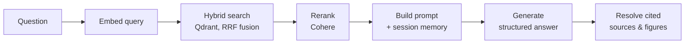

# RAG Pipeline

The pipeline lives in [`src/api/rag/retrieval.py`](../reference/rag.md) and is entered
through `rag_pipeline_wrapper`, which builds the Qdrant client and delegates to
`rag_pipeline`.



## 1. Embedding

`get_embedding` calls the OpenAI embeddings endpoint with `EMBEDDING_MODEL`
(`text-embedding-3-small` by default) and records token usage on the current LangSmith run.

## 2. Hybrid retrieval

`retrieve_context` issues a single Qdrant `query_points` call with two prefetch branches,
fused with Reciprocal Rank Fusion:

- a **dense** branch querying the embedding vector, limit 20;
- a **sparse/keyword** branch filtering on a full-text `MatchText` condition over the `text`
  payload field, limit 20.

Each returned point is flattened into a dict carrying `id`, `text`, `title`, `authors`,
`year`, `page`, `score`, `type`, `image_path`, and `caption`.

## 3. Reranking

`rerank_context` sends the candidate texts to Cohere's `rerank-english-v3.0` and keeps the
top `top_n`, attaching a `rerank_score` to each surviving chunk.

!!! note "Evaluation mode"
    When `EVALUATION_MODE=true`, the pipeline retrieves `top_k=5` directly and **skips
    reranking**, so evaluation measures the retriever rather than the reranker. In normal
    mode it retrieves 20 candidates and reranks down to `top_k`.

## 4. Prompt construction

`process_context` formats the chunks, and `build_prompt` combines them with the question and
the session's conversation memory.

### Conversation memory

`ConversationMemory` keeps a `window_size` of 10 messages (five turns) alongside a rolling
`summary` and the `full_history`.

- `get_memory(session_id)` unpickles the object from Redis, or creates one with a 3600 s TTL.
- `add_message(session_id, role, content)` appends to the buffer and, once the window
  overflows, calls `summarize_conversation` on the overflow and folds the result into
  `summary`, keeping only the most recent messages verbatim.
- Summarization runs on Groq using `SUMMARIZATION_MODEL` and the `summarize_conversation`
  prompt template.

## 5. Generation

`generate_answer` dispatches to OpenAI or Groq — `is_openai_model` decides — and returns a
structured `RAGGenerationResponse` containing the answer text and the
`retrieved_context_ids` the model actually used.

## 6. Source and figure resolution

The pipeline deduplicates sources on `(authors, title, year)`, merges their page numbers into
a sorted list, and then **filters out any source the model did not cite**. Chunks of
`type == "figure"` that were cited become `images` entries pointing at
`/api/images/<filename>`, which the UI renders inline.

The returned payload is:

```python
{
    "answer": str,
    "sources": list[Source],   # deduplicated, cited only
    "images": list[dict],      # cited figures
    "question": str,
    "retrieved_context": list[str],
}
```

## Intent routing and metadata questions

Not every question needs retrieval. `src/api/rag/intent_router.py` classifies the question
into a `MetadataIntent`, and `src/api/rag/metadata_handlers.py` answers catalogue-style
questions directly from payload metadata — `list_titles`, `list_authors`,
`titles_by_author`, `author_of_title`, and `summarize_paper`.
