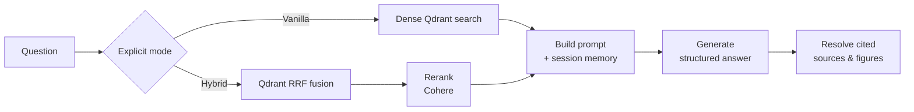

# RAG Pipeline

This page explains the shared mechanics and current implementation. For the product-level
definition and availability of each comparison architecture, start with
[RAG modes](rag-modes.md).

The answer-generation pipeline is entered through `rag_pipeline_wrapper` in
[`src/api/rag/retrieval.py`](../reference/rag.md). Retrieval strategies are deliberately
separate so that each comparison mode remains understandable and independently testable:

| Responsibility | Module |
| --- | --- |
| Shared corpus/evidence contracts | `src/api/rag/contracts.py` |
| Mode selection only | `src/api/rag/dispatcher.py` |
| Vanilla retrieval | `src/api/rag/modes/vanilla.py` |
| Hybrid retrieval and reranking | `src/api/rag/modes/hybrid.py` |
| PostgreSQL paper discovery | `src/api/rag/tools/paper_search.py` |
| Scoped Qdrant chunk retrieval | `src/api/rag/tools/chunk_search.py` |
| Exact-section expansion | `src/api/rag/tools/section_retrieval.py` |
| Ordinal neighbour expansion | `src/api/rag/tools/neighbor_retrieval.py` |
| Shared prompting, generation and citation resolution | `src/api/rag/retrieval.py` |

Future Agentic and KG modes get their own files under `modes/`; they compose the shared
read-only tools instead of replacing Vanilla or Hybrid.



## 1. Embedding

`get_embedding` calls the OpenAI embeddings endpoint with `EMBEDDING_MODEL`
(`text-embedding-3-small` by default). When enabled, the Langfuse OpenAI wrapper records
latency and token usage.

## 2. Explicit corpus scope and retrieval

The API resolves the selected corpus in PostgreSQL before querying Qdrant. A
`RetrievalScope` contains the collection and exact allowed build IDs:

- an `active` scope accepts only the currently active, ready builds selected by the
  catalogue;
- a `frozen` scope accepts the exact ready build IDs stored in an evaluation snapshot,
  including a retained older build;
- every Qdrant query receives the scope filter, and every result is validated against it;
- returned `EvidenceChunk` objects retain collection, build, paper, chunk, page and section
  identity. Missing or drifting identities fail closed instead of becoming answer context.

Legacy adopted uploads can lack `build_id` in their historical Qdrant payload. Their scoped
manifest point IDs are used to recover the registered build/paper identity; this does not
make unregistered points queryable.

`search_papers` searches title, author, year, source and title/abstract terms in the
PostgreSQL catalogue. `search_chunks` performs vector retrieval in Qdrant. Both are direct,
read-only functions and do not depend on an agent framework.

`get_section` returns an exact Markdown section breadcrumb in document order.
`get_neighbors` returns the anchor chunk and a bounded window on either side. Both require
the paper/build identity explicitly, enforce the same active or frozen scope, and reject
evidence without a stable `chunk_index`. They are reusable capabilities for the future
Agentic mode; Vanilla and Hybrid do not call them.

### Hybrid retrieval

`retrieve_context` issues a single Qdrant `query_points` call with two prefetch branches,
fused with Reciprocal Rank Fusion:

- a **dense** branch querying the embedding vector, limit 20;
- a **full-text-constrained dense** branch applying `MatchText` to the `text` payload while
  querying with the same dense vector, limit 20.

Each returned point is validated as an `EvidenceChunk`, including `collection`, `build_id`,
`paper_id`, `id`, `page`, `section_header` and content metadata in addition to display fields.

## 3. Reranking

`rerank_context` sends the candidate texts to Cohere's `rerank-english-v3.0` and keeps the
top `top_n`, attaching a `rerank_score` to each surviving chunk.

!!! note "Explicit comparison modes"
    Vanilla retrieves `top_k` dense results without reranking. Hybrid retrieves 20 fused
    candidates and reranks to `top_k`. The reviewed benchmark invokes these explicit modes;
    the old `EVALUATION_MODE` behavior applies only to the legacy evaluator.

## 4. Prompt construction

`process_context` formats the chunks, and `build_prompt` combines them with the question and
the session's conversation memory.

### Conversation memory

`ConversationMemory` keeps a `window_size` of 10 messages (five turns) alongside a rolling
`summary` and the `full_history`.

- `get_memory(session_id)` unpickles the object from Redis, or creates one with a 3600 s TTL.
- `add_message(session_id, role, content)` appends to the buffer and, once the window
  overflows, calls `summarize_conversation` on the overflow and folds the result into
  `summary`, keeping only the most recent messages verbatim.
- Summarization runs on Groq using `SUMMARIZATION_MODEL` and the `summarize_conversation`
  prompt template.

## 5. Generation

`generate_answer` dispatches to OpenAI or Groq — `is_openai_model` decides — and returns a
structured `RAGGenerationResponse` containing the answer text and the
`retrieved_context_ids` the model actually used. The Pydantic response model is also the
single source for the provider JSON schema. OpenAI generation uses strict structured output,
rejects duplicate or unavailable context IDs, and makes at most one additional model call
when the first structured response is malformed.

## 6. Source and figure resolution

The pipeline deduplicates sources on `(authors, title, year)`, merges their page numbers into
a sorted list, and then **filters out any source the model did not cite**. Chunks of
`type == "figure"` that were cited become `images` entries pointing at
`/api/images/<filename>`, which the UI renders inline.

The returned payload is:

```python
{
    "answer": str,
    "sources": list[Source],   # deduplicated, cited only
    "images": list[dict],      # cited figures
    "question": str,
    "retrieved_context": list[str],
}
```

## Intent routing and metadata questions

Not every question needs retrieval. `src/api/rag/intent_router.py` classifies the question
into a `MetadataIntent`, and `src/api/rag/metadata_handlers.py` answers catalogue-style
questions directly from payload metadata — `list_titles`, `list_authors`,
`titles_by_author`, `author_of_title`, and `summarize_paper`.
