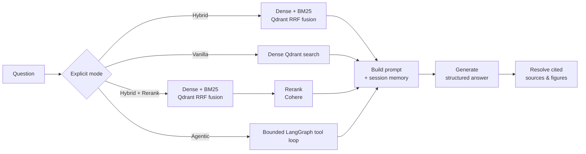

# RAG Pipeline

This page explains the shared mechanics and current implementation. For the product-level
definition and availability of each comparison architecture, start with
[RAG modes](rag-modes.md).

The answer-generation pipeline is entered through `rag_pipeline_wrapper` in
[`src/api/rag/retrieval.py`](../reference/rag.md). Retrieval strategies are deliberately
separate so that each comparison mode remains understandable and independently testable:

| Responsibility | Module |
| --- | --- |
| Shared corpus/evidence contracts | `src/api/rag/contracts.py` |
| Mode selection only | `src/api/rag/dispatcher.py` |
| Vanilla retrieval | `src/api/rag/modes/vanilla.py` |
| Hybrid dense + sparse fusion | `src/api/rag/modes/hybrid.py` |
| Hybrid fusion plus Cohere reranking | `src/api/rag/modes/hybrid_rerank.py` |
| Shared BM25 sparse encoding/index contract | `src/api/rag/sparse.py` |
| PostgreSQL paper discovery | `src/api/rag/tools/paper_search.py` |
| Scoped Qdrant chunk retrieval | `src/api/rag/tools/chunk_search.py` |
| Exact-section expansion | `src/api/rag/tools/section_retrieval.py` |
| Ordinal neighbour expansion | `src/api/rag/tools/neighbor_retrieval.py` |
| Agentic public budget/execution contracts | `src/api/rag/modes/agentic/contracts.py` |
| Agentic LangGraph state and orchestration | `src/api/rag/modes/agentic/state.py`, `graph.py` |
| Agentic LangChain tool adapters and safety policy | `src/api/rag/modes/agentic/tools.py`, `policies.py` |
| Agentic pipeline adapter | `src/api/rag/modes/agentic/executor.py` |
| Shared prompting, generation and citation resolution | `src/api/rag/retrieval.py` |

Agentic orchestration lives under `modes/agentic/` and uses LangGraph's state graph plus
LangChain's native per-tool schemas. The model selects one of four request-scoped read-only
retrieval tools and later calls either `finish_with_evidence` or `abstain`. Application code,
not the model, enforces the approved corpus boundary, duplicate detection and hard budgets.
This avoids a custom provider-specific plan/assessment JSON protocol. Future KG modes will
get their own isolated modules and can expose graph retrieval as another typed tool without
replacing the four current modes.


```mermaid
flowchart LR
    Q[Question] --> M{Explicit mode}
    M -->|Vanilla| D[Dense Qdrant search]
    M -->|Hybrid| H[Dense + BM25<br/>Qdrant RRF fusion]
    M -->|Hybrid + Rerank| HR[Dense + BM25<br/>Qdrant RRF fusion]
    M -->|Agentic| A[Bounded LangGraph tool loop]
    HR --> R[Rerank<br/>Cohere]
    H --> P
    D --> P[Build prompt<br/>+ session memory]
    R --> P
    A --> P
    P --> G[Generate<br/>structured answer]
    G --> S[Resolve cited<br/>sources & figures]
```

## 1. Embedding

`get_embedding` calls the OpenAI embeddings endpoint with `EMBEDDING_MODEL`
(`text-embedding-3-small` by default). When enabled, the Langfuse OpenAI wrapper records
latency and token usage.

## 2. Explicit corpus scope and retrieval

The API resolves the selected corpus in PostgreSQL before querying Qdrant. A
`RetrievalScope` contains the collection and exact allowed build IDs:

- an `active` scope accepts only the currently active, ready builds selected by the
  catalogue;
- a `frozen` scope accepts the exact ready build IDs stored in an evaluation snapshot,
  including a retained older build;
- every Qdrant query receives the scope filter, and every result is validated against it;
- returned `EvidenceChunk` objects retain collection, build, paper, chunk, page and section
  identity. Missing or drifting identities fail closed instead of becoming answer context.

Legacy adopted uploads can lack `build_id` in their historical Qdrant payload. Their scoped
manifest point IDs are used to recover the registered build/paper identity; this does not
make unregistered points queryable.

`search_papers` searches title, author, year, source and title/abstract terms in the
PostgreSQL catalogue. `search_chunks` performs dense, sparse or fused retrieval in Qdrant. Both are direct,
read-only functions and do not depend on an agent framework.

`get_section` returns an exact Markdown section breadcrumb in document order.
`get_neighbors` returns the anchor chunk and a bounded window on either side. Both require
the paper/build identity explicitly, enforce the same active or frozen scope, and reject
evidence without a stable `chunk_index`. Agentic may call them after observing exact
identifiers; Vanilla and Hybrid do not call them.

### Hybrid retrieval

`retrieve_context` issues a single Qdrant `query_points` call with two prefetch branches,
fused with Reciprocal Rank Fusion:

- a **dense** branch querying the embedding vector, limit 20;
- a **BM25 sparse** branch querying the named `bm25` sparse vector, limit 20.

At ingestion, every point receives both its unnamed OpenAI dense vector and a named `bm25`
sparse vector. The sparse encoder applies deterministic token IDs and BM25 term-frequency/
length weights; Qdrant's `IDF` modifier supplies live collection IDF. Qdrant then fuses the
independent rankings with RRF. Exact sparse search is also available to the Agentic tool.

Each returned point is validated as an `EvidenceChunk`, including `collection`, `build_id`,
`paper_id`, `id`, `page`, `section_header` and content metadata in addition to display fields.

## 3. Reranking

`rerank_context` sends the candidate texts to Cohere's `rerank-english-v3.0` and keeps the
top `top_n`, attaching a `rerank_score` to each surviving chunk.

!!! note "Explicit comparison modes"
    Vanilla retrieves `top_k` dense results. Hybrid returns `top_k` RRF-fused results.
    Hybrid + Rerank retrieves at least 20 fused candidates and reranks to `top_k` with
    Cohere. The reviewed benchmark invokes these explicit modes; the old `EVALUATION_MODE`
    behavior applies only to the legacy evaluator.

## 4. Prompt construction

`process_context` formats the chunks, and `build_prompt` combines them with the question and
the session's conversation memory.

### Conversation memory

`ConversationMemory` keeps a `window_size` of 10 messages (five turns) alongside a rolling
`summary` and the `full_history`.

- `get_memory(session_id)` unpickles the object from Redis, or creates one with a 3600 s TTL.
- `add_message(session_id, role, content)` appends to the buffer and, once the window
  overflows, calls `summarize_conversation` on the overflow and folds the result into
  `summary`, keeping only the most recent messages verbatim.
- Summarization runs on Groq using `SUMMARIZATION_MODEL` and the `summarize_conversation`
  prompt template.

## 5. Generation

`generate_answer` dispatches to OpenAI or Groq — `is_openai_model` decides — and returns a
structured `RAGGenerationResponse` containing atomic `claims`, their exact cited chunk IDs
and Agentic need IDs. Flattened answer text and `retrieved_context_ids` are derived from
those claims. The Pydantic response model is also the single source for the provider JSON
schema. OpenAI generation uses native SDK Pydantic parsing and strict structured output,
rejects duplicate or unavailable context IDs, and makes at most one additional model call
when the first structured response is malformed.

### Structured response enforcement

`src/api/core/structured.py` calls `client.chat.completions.parse(response_format=Model)`
for live OpenAI answers and Agentic drafts/reviews, and
`client.responses.parse(text_format=Model)` for synchronous evaluation judges. The SDK
converts Pydantic models into provider-compatible schemas and parses typed results, following
[OpenAI's Structured Outputs guidance](https://developers.openai.com/api/docs/guides/structured-outputs).
It handles schema reference normalization; the application does not hand-edit JSON schemas.

The helpers perform one request and normalize safe failure codes for invalid JSON, missing
fields, refusals, completion limits, content filtering and incomplete Responses output.
Network/API errors propagate without another helper retry. SDK transport retries are
explicitly disabled on these OpenAI calls; the existing caller-owned generation/repair
limits remain authoritative. Agentic keeps its 60-second timeout and separate draft/verifier
completion caps. Models, reasoning settings, prompts and scientific validation are unchanged.

Instructor remains in Groq generation, extraction, summarization and legacy intent paths;
LangGraph retains native typed tools. Background evaluation-question generation is deliberately
unchanged: it must persist submission IDs, poll and resume rather than treating a queued
response as missing output and submitting another paid request. No re-index or dataset
regeneration is needed for this standardization.

Typed output is not scientific proof. Citation identity, numeric/unit support, semantic
review and required-answer coverage are still checked separately. Shared OpenAI clients retain
Langfuse instrumentation of both native parsing methods. Offline tests exercise the installed
SDK through mocked HTTP, including its schema conversion and trace hooks; they are not live
quality or connectivity tests. See the [evaluation guide](../operations/evaluation.md).

## 6. Source and figure resolution

The pipeline deduplicates sources on `(authors, title, year)`, merges their page numbers into
a sorted list, and then **filters out any source the model did not cite**. Chunks of
`type == "figure"` that were cited become `images` entries pointing at
`/api/images/<filename>`, which the UI renders inline.

The returned payload is:

```python
{
    "answer": str,
    "sources": list[Source],   # deduplicated, cited only
    "images": list[dict],      # cited figures
    "question": str,
    "retrieved_context": list[str],
}
```

## Intent routing and metadata questions

Not every question needs retrieval. `src/api/rag/intent_router.py` classifies the question
into a `MetadataIntent`, and `src/api/rag/metadata_handlers.py` answers catalogue-style
questions directly from payload metadata — `list_titles`, `list_authors`,
`titles_by_author`, `author_of_title`, and `summarize_paper`.
