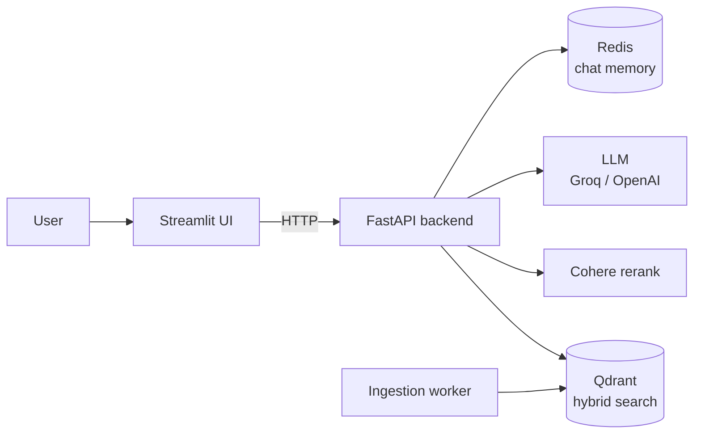

# RAG Demo

A modular **Retrieval-Augmented Generation** system for querying large collections of PDF
documents through a web chat interface.

## What this stack does

| Layer | Technology |
| --- | --- |
| Frontend | Streamlit chat interface |
| Backend | FastAPI, orchestrating the RAG pipeline |
| Embeddings | OpenAI `text-embedding-3-small` |
| Vector store | Qdrant Cloud (dense + full-text-constrained fusion) |
| Reranking | Cohere Rerank |
| Generation | Groq (`llama-3.3-70b-versatile`) or OpenAI (`gpt-4.1-*`, `gpt-5-nano`) |
| Memory | Redis, sliding window with summarization |
| Tracing and experiment tracking | Repo-owned Langfuse Docker stack (optional) |

## Key features

- **Conversational chat** — multi-turn dialogue with a per-session memory system.
- **PDF knowledge base** — upload and process large collections of PDFs.
- **Hybrid search** — semantic and keyword retrieval combined, then reranked.
- **Source citation** — answers reference author, title, year, and page numbers.
- **Multi-user sessions** — Redis keeps each conversation independent.

## Where to go next

- [Installation](getting-started/installation.md) — get the stack running locally.
- [Configuration](getting-started/configuration.md) — environment variables and `config.yaml`.
- [Architecture](architecture/index.md) — how the components fit together.
- [RAG modes](architecture/rag-modes.md) — exact definitions and availability of Vanilla,
  Hybrid, Agentic and future knowledge-graph modes.
- [Code Reference](reference/index.md) — API generated from the docstrings.

!!! note "Building these docs"
    Run `make docs` to serve this site locally at <http://127.0.0.1:8000>.
